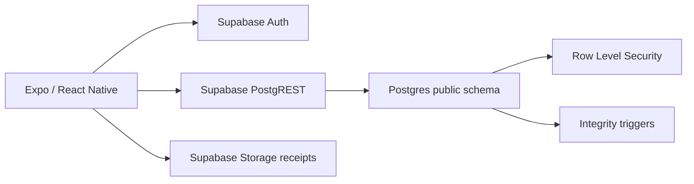
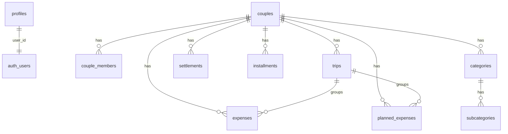

# Arquitetura backend

## Visao geral

## Entidades principais

## Fluxo de autenticacao e workspace

1. Usuario autentica via Supabase Auth.
2. App carrega `profiles` e `couple_members`.
3. Se nao houver workspace, tela de setup chama RPC `create_workspace`.
4. RPC cria perfil, casal, membro admin e categorias padrao em uma transacao.
5. RLS permite leitura/escrita operacional somente a membros do casal.

## Autorizacao

- Membro: opera viagens, gastos, planejamento, checklist, roteiro, metas, parcelas e acertos do proprio casal.
- Admin: alem do operacional, gerencia membros e pode excluir casal.
- `is_couple_member` protege dados operacionais.
- `is_couple_admin` protege administracao de casal/membros.

## Fluxo de gasto com comprovante

1. Usuario preenche gasto.
2. Se for gasto novo e escolher arquivo, o arquivo fica pendente no formulario.
3. Submit cria a despesa no banco.
4. App envia comprovante para `receipts/{couple_id}/{expense_id}/{arquivo}`.
5. App atualiza `expenses.receipt_url` com o path privado.
6. Leitura usa signed URL temporaria.

## Fluxo de acertos

1. `calculateSettlement` soma despesas reembolsaveis.
2. Gastos divididos usam percentuais.
3. Gastos individuais usam `beneficiary_person`.
4. Gastos nao reembolsaveis nao geram saldo entre pessoas.
5. Acertos `concluido` ou `pago` sao abatidos do saldo.
6. Tela evita registrar acerto duplicado com mesmo pagador, recebedor e valor.

## Integridade

- Triggers bloqueiam FK cruzada entre casal e viagem/categoria/subcategoria.
- `couple_members_one_workspace_per_user` torna o modelo de um casal por usuario explicito.
- Validadores Zod antecipam erros de parcelas, status e faixas financeiras.

## Sincronizacao

Hooks financeiros assinam Supabase Realtime para tabelas com `couple_id`. Em eventos de insert/update/delete, o app invalida queries `finance` e `workspace`.
